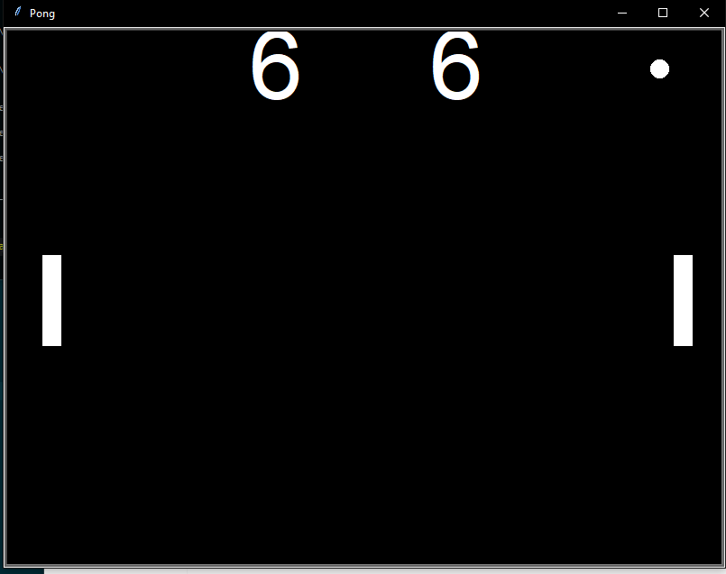

# Pong-Game
Juego Retro llamado pong, esta echo en python :)


para ejecutarlo escriba esto en su terminal
```bash
python3 main.py
```
si esta en linux
```bash
python main.py
```
capturas del juego


